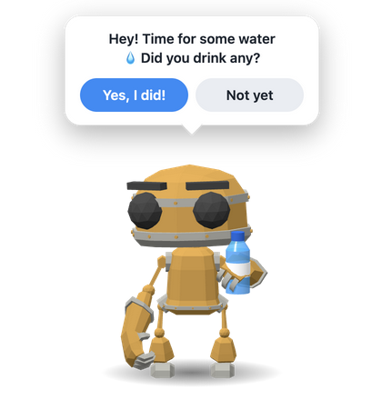
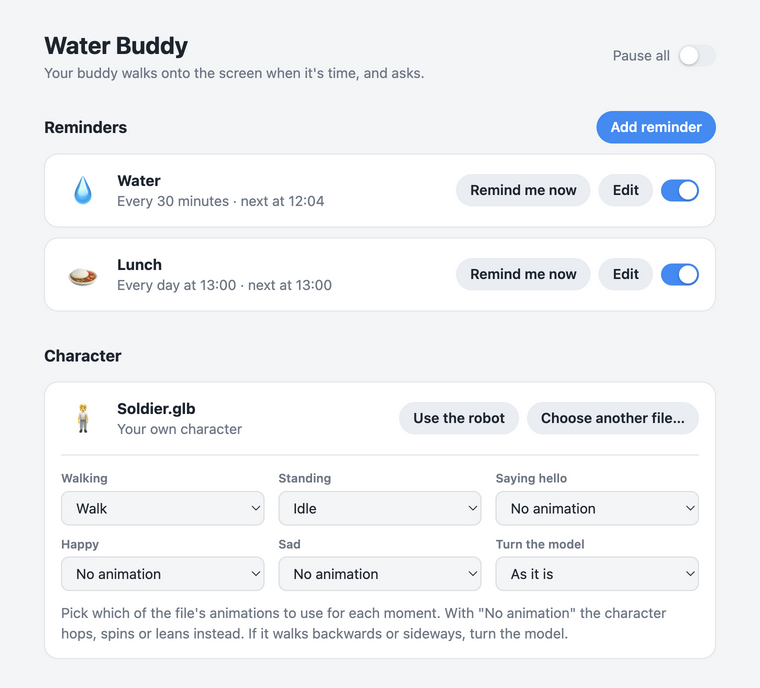

# Buddy

A small 3D character that walks onto your screen when it's time for something (water, lunch, a stretch) and asks whether you did it. Say yes and it celebrates. Say not yet and it walks away sad, then comes back to ask again.

<p>
  
  
</p>

- **Your own reminders.** Repeat every N minutes or once a day at a set time, on the days you choose: every day, Mon–Fri, weekends, or any mix. Ready-made ones for water, lunch, stretching, eye breaks and medicine.
- **Stays out of the way.** The buddy walks along the bottom of the screen, above the Dock or taskbar. Clicks go through to your apps everywhere except on its speech bubble, and it never takes keyboard focus.
- **Your own character.** Load any `.glb` 3D model in place of the built-in robot.
- **Runs from the menu bar** on macOS and from the system tray on Windows.

## Status

| Platform | State |
| --- | --- |
| macOS (Apple silicon) | Built and tested |
| macOS (Intel) | Included in the universal build, not tested on an Intel Mac |
| Windows 10/11 (x64) | Builds, but not yet tested on a real Windows PC |
| Linux | Not supported |

If you try it on Windows or an Intel Mac, please open an issue and say how it went.

## Set up from source

You need [Node.js](https://nodejs.org) 22.12 or newer and git.

```bash
git clone https://github.com/sundeep-build/buddy.git
cd buddy
npm install
npm start
```

`npm install` downloads Electron (about 100 MB), so the first run takes a minute.

The settings window opens when the app starts. Click **Remind me now** on a reminder to see the buddy straight away.

## Using it

- **Add a reminder:** click **Add reminder**, pick a ready-made one or fill in a name, an emoji and the question the buddy should ask, then choose *Every N minutes* or *Once a day at* a time, and the days it should run on.
- **Answering:** *Yes, I did!* counts it for today and schedules the next visit. *Not yet*, or no answer within 45 seconds, brings the buddy back in 10 minutes. A daily reminder stops asking again about an hour after its time.
- **Closing the window** does not quit the app. It keeps running from the 💧 in the macOS menu bar, or the water-drop icon in the Windows tray (it may be under the `^` arrow). From there you can call the buddy, open the settings, pause all reminders, or quit.

Reminders, today's counts and your character are saved per computer:

- macOS: `~/Library/Application Support/Buddy/`
- Windows: `%APPDATA%\Buddy\`

## Using your own character

In the settings window, under **Character**, click **Use my own character…** and choose a `.glb` file.

- If the model has animations, the app guesses which one to use for walking, standing, saying hello, happy and sad from their names. You can change each one in the settings.
- Where there is no animation, the character hops, spins or leans instead, so a model with no animations at all still works.
- If the character walks backwards or sideways, use **Turn the model**.
- A flat model (a picture on a plane) always faces you instead of turning.
- Draco- and Meshopt-compressed files are supported.

**Use the robot** switches back to the built-in character.

## Building the app

```bash
npm run build:mac   # dist/Buddy-darwin-universal/Buddy.app  (run this on a Mac)
npm run build:win   # dist/Buddy-win32-x64/Buddy.exe
npm run build       # both, on a Mac
```

The Mac build is one app for both Intel and Apple-silicon Macs. `build:mac` only works on macOS because it signs the app with `codesign`. `build:win` also works from a Mac.

### First launch on someone else's computer

The builds are not signed with an Apple Developer ID or a Windows certificate, so the system warns the first time:

- **macOS:** open the app once, then go to System Settings → Privacy & Security and click **Open Anyway**.
- **Windows:** unzip the whole folder and run `Buddy.exe`. If "Windows protected your PC" appears, click **More info**, then **Run anyway**.

## How the code is laid out

| File | What it does |
| --- | --- |
| `main.js` | Main process: the reminder schedule, the overlay window, the settings window, the menu bar / tray |
| `renderer.js`, `index.html`, `styles.css` | The overlay: draws the character with three.js and plays one visit |
| `settings.js`, `settings.html`, `settings.css` | The settings window |
| `preload.js`, `settings-preload.js` | The bridges between each window and the main process |
| `schedule.js` | Works out when each reminder is next due |
| `presets.js` | The ready-made reminders and their texts |
| `character.js` | Reads the animation list from a `.glb` and guesses which clip fits which moment |
| `scripts/start.js` | Starts the app from source on any OS |
| `assets/` | The robot model and the app icons |

